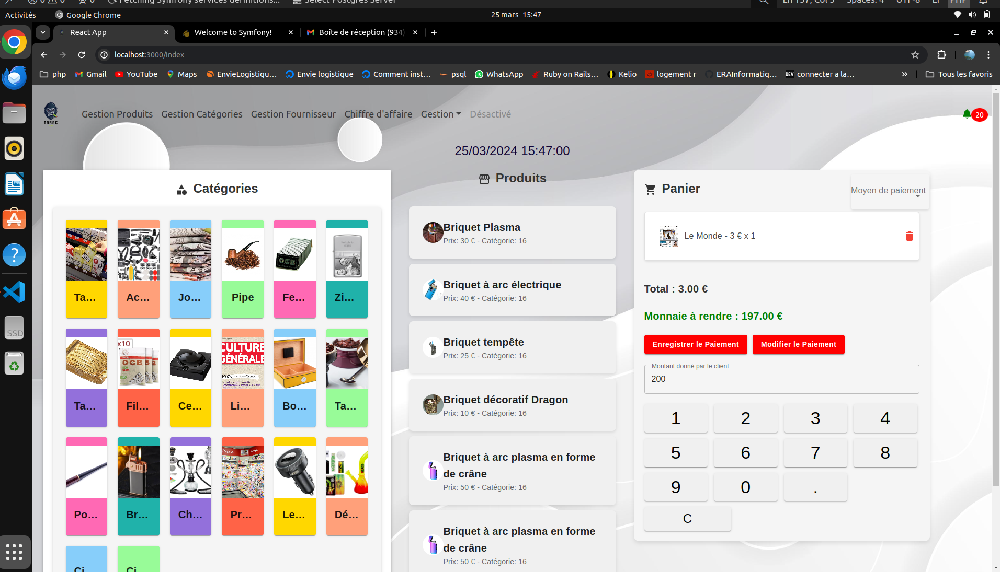

file:///home/tafat/Vid%C3%A9os/Captures%20vid%C3%A9o/Capture%20vid%C3%A9o%20du%2025-03-2024%2019:40:49.webm


```markdown
# TabacEase-Back


## Description

Ce référentiel contient le code source de l'application TabacEase-Back, une API développée en Symfony pour gérer les paiements, les encaissements, les produits, les fournisseurs, et calculer le chiffre d'affaires d'un bureau de tabac.

## Installation

### PostgreSQL

1. Assurez-vous d'avoir les droits d'administration sur votre système.
2. Utilisez le gestionnaire de paquets de votre système pour installer PostgreSQL. Par exemple, sur Ubuntu, vous pouvez exécuter :

```bash
sudo apt update
sudo apt install postgresql postgresql-contrib
```

3. Une fois l'installation terminée, démarrez le service PostgreSQL :

```bash
sudo service postgresql start
```

### PHP 8.1

1. Ajoutez le référentiel PPA pour PHP 8.1 (si vous utilisez Ubuntu) :

```bash
sudo add-apt-repository ppa:ondrej/php
```

2. Mettez à jour la liste des paquets :

```bash
sudo apt update
```

3. Installez PHP 8.1 et les extensions requises :

```bash
sudo apt install php8.1 php8.1-cli php8.1-common php8.1-curl php8.1-xml php8.1-mbstring php8.1-pgsql
```

4. Vérifiez l'installation de PHP en exécutant :

```bash
php -v
```

### Symfony CLI

1. Téléchargez l'exécutable Symfony CLI en utilisant cURL :

```bash
wget https://get.symfony.com/cli/installer -O - | bash
```

2. Déplacez l'exécutable Symfony CLI dans un répertoire accessible :

```bash
sudo mv ~/.symfony/bin/symfony /usr/local/bin/symfony
```

3. Assurez-vous que Symfony CLI est bien installé en exécutant :

```bash
symfony -v
```

Une fois ces étapes terminées, vous devriez avoir PostgreSQL, PHP 8.1 et Symfony CLI installés sur votre système. Vous pouvez ensuite procéder à l'installation de votre application TabacEase-Back en suivant les instructions fournies dans votre référentiel.
```
=======
Voici une mise à jour du README.md pour TabacEase-Front :

```markdown
# TabacEase-Front

## Description

Ce référentiel contient le code source de l'application TabacEase-Front, une interface utilisateur développée en React.js pour gérer les paiements, les encaissements, les produits, les fournisseurs, et afficher le chiffre d'affaires d'un bureau de tabac.

## Installation

Assurez-vous d'avoir npm installé sur votre système. Vous pouvez vérifier la version actuellement installée en exécutant :

```bash
npm --version
```

Si npm n'est pas installé, vous pouvez le faire en suivant les instructions sur https://www.npmjs.com/get-npm.

### Téléchargement du code source

Clonez le référentiel depuis GitHub en utilisant la commande suivante :

```bash
git clone git@github.com:tafat1566/tabac-case-front.git
```

### Installation des dépendances

Accédez au répertoire du projet TabacEase-Front :

```bash
cd tabac-case-front
```

Installez les dépendances npm en exécutant :

```bash
npm install
```

### Exécution de l'application

Une fois les dépendances installées, vous pouvez lancer l'application en mode développement avec la commande :

```bash
npm start
```

Cela démarrera un serveur de développement et ouvrira votre navigateur par défaut avec l'application TabacEase-Front.

### Accès à l'application

Ouvrez votre navigateur web et accédez à l'URL suivante :

```
http://localhost:3000
```

Vous devriez maintenant pouvoir utiliser l'application TabacEase-Front pour gérer les opérations liées à un bureau de tabac.
``` 


>>>>>>> origin/main
